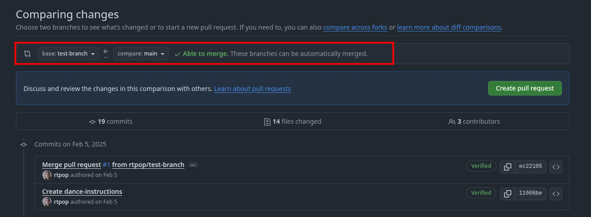

# Git and GitHub crash course
This is a repository for the practical component of a git & GitHub course. This includes a short presentation of git and the main features of git, as well as a more detailed guide of the basics of git and GitHub. 

Slides:
https://docs.google.com/presentation/d/1pOj41FHSDqTLEfji0Nqh9-PoDVcq861yObhCFfQM0TU/edit?usp=sharing

# Contents

- [Git and GitHub crash course](#git-and-github-crash-course)
- [Contents](#contents)
  - [Git and GitHub basics](#git-and-github-basics)
    - [Creating a repository](#creating-a-repository)
    - [Adding files](#adding-files)
    - [Committing](#committing)
    - [Reverting to a previous commit](#reverting-to-a-previous-commit)
    - [Pushing and pulling](#pushing-and-pulling)
    - [Branches](#branches)
    - [Cloning a repository](#cloning-a-repository)
    - [Forking a repository](#forking-a-repository)
    - [Pull requests](#pull-requests)
    - [Merging](#merging)
  - [Elements of a GitHub repository](#elements-of-a-github-repository)
    - [.gitignore](#gitignore)
    - [LICENSE](#license)
    - [README](#readme)

## Git and GitHub basics
Git is a widely used version control system designed to track changes made to files within a repository. It was primarily designed for programming, but it can be used to version control any document. Services such as GitHub are a great way of collaborating on projects or even backing up your code or other important documents while tracking any changes made for future reference. GitHub has a [comprehensive tutorial](https://docs.github.com/en/get-started/start-your-journey) on how to use git with GitHub, along with some practical exercises. Here, I will only briefly describe the main concepts. 

I will primarily go over how to use the web based GitHub service as well as use git locally via command line. However, if you are not comfortable with using command line, there is also a [GitHub desktop application](https://desktop.github.com/download/). Although that is outside the scope of this tutorial, many of the features of the desktop app are similar to the web based version. Additionally, many IDEs provide GitHub integration and have some visual interfaces for interacting with git. Here is a [great tutorial for setting up GitHub with RStudio](https://rfortherestofus.com/2021/02/how-to-use-git-github-with-r) and one for setting it up with [Visual Studio Code](https://code.visualstudio.com/docs/sourcecontrol/github).

### Creating a repository
The first thing you need to do to use git and GitHub is to create a repository. On the GitHub website, you can create a new repository by going to the ```Repositories``` tab in your account and clicking on the ```New``` button.


<br>

This will open a new page where you can customise details of your repository, such as name and description. The name of the repostory must be unique, but GitHub will check if the name you have chosen is available.


<br>

You can also edit some other details, such as whether the repository should be public, add a [license](#license), a [.gitignore](#gitignore) or a [readme](#readme) file. 


<br>

Once you've created your repository, you can [clone](#cloning-a-repository) it on your computer to work on it directly from there.

You an also initialise any folder (new or existing) into a git repository via command line. Navigate to the desired folder in a terminal and use the command:

```function test()
git init
```

You can add any existing local repository to GitHub, but I will not discuss that here. In most cases, it's easier to simply create the remote repository first on the GitHub website and then clone it to you local computer. However, if you need to add an existing repository to GitHub, you can read more about it [here](https://docs.github.com/en/get-started/git-basics/managing-remote-repositories?platform=linux)

### Adding files
In order for git to track a file, it must first be added to the repository. When creating a file directly on GitHub, it will automatically be added to the repository. However, if you create a file locally, you must first add it by opening a terminal and using the ```git add``` command.

```function test()
git add your_file_name
```

You can add multiple files at once, or even the entire repository.

```function test()
git add your_file_name your_other_file_name
```

```function test()
git add .
```

You must [commit](#committing) added files as you would any other change. If you want a file (or folder) not to be tracked by git, you can add it to [.gitignore](#gitignore).

It is also possible to remove a file from the tracked files if you do not want it to be tracked any longer. You can check files currently tracked by git with

```function test()
git status
```

And remove files with

```function test()
git rm --cached your_file_name
```

Note that this will not remove the file itself, it will only remove the tracking of the file. 

### Committing
Commits are the backbone of git and are how we can track changes made to any file. Every time you make a new commit, you have to include a commit message. Each commit is assigned a unique ID, so it can be found at any point and the changes committed in that commit can be seen. If you edit a file on GitHub directly, it will automatically commit when saving changes and prompt you for a commit message. You can also commit manually by pressing the green ```Commit changes``` button.


<br>

To commit via command line on your local machine, open a terminal, navigate to your repository and use the following command.

```function test()
    git commit your_file_name -m "Your commit message"
```

It is also possible to commit multiple files at once.

```function test()
    git commit your_file_name your_other_file_name -m "Your commit message"
```

You an also commit an entire folder by specifyinf the folder name instead of the file name.

```function test()
    git commit your_folder_name -m "Your commit message"
```

Or if you want to commit the folder you are currently in:

```function test()
    git commit . -m "Your commit message"
```

Finally, you can commit all changed files in the repository, although this is typically not recommended. It is best practice to keep commits small and frequent so you can easily track each change and the purpose of that change. This is especially important for colaborative code where someone else might need to understand what changes you made and why (but it is also incredibly useful for your future self!).

```function test()
    git commit -m "Your commit message"
```

### Reverting to a previous commit
One of the great things about git is that you can restore your files to a previous version at any time. Unfortunately, this is not something that can be easily done on the GitHub website. However, you can do this in the command line or in [GitHub Desktop](https://docs.github.com/en/desktop/managing-commits/reverting-a-commit-in-github-desktop).

To do it via the command line, you must first identify the commit you want to revert to. Each commit will have a unique ID assigned to it when it is created. You can see a list of all your commits, their IDs and their commit messages by using the command:

```function test()
git log --oneline
```

An alternative is to go to your repository on GitHub and check the history of the file that you want to revert. To do this, open your file on GitHub and click on the "History" button in the top right corner.


<br>

This will open a list of all the commits that were made for that file, along with their commit messages and IDs (highlighted in red).


<br>

Once you have identified the commit you want to revert to, you can revert to that commit with the following command:

```function test()
git revert your_commit_id
```

### Pushing and pulling
Pushing and pulling is how we can sync the local and remote repositories. We can push any changes we make locally to the remote repository only if they have been committed first. When pushing an pulling, git will check for conflicts between the loal and remote versions to avoid overwriting information. If it cannot automatically resolve the differences between the two versions without any loss of information, it will require you to manually resolve it by choosing which version to keep. This is especially important when working in collaboration and this is why using [branches](#branches) is important. 

To push and pull, use the following commands. Make sure you are in the directory where your repository is stored.

```function test()
git pull
```
```function test()
git push origin main
```

Alternatively, you can use the full path to your repository to push/pull from a different location.

```function test()
git pull /path/to/your/repository
```
```function test()
git push /path/to/your/repository origin main
```

It is also possible to only push some files.

```function test()
git push your_file_name origin main
```

### Branches
Branches are a way of diverging from the main "state@ of a file without ovewriting or changing it. In essence, it allows us to modify code or documents in our repository without having to overwrite anything that we have already written. This is useful for testing out new code features before including them in the main code base. It is also useful when collaboarting. Allowing multiple people to work on the same documents simultaneously without having to worry if their changes conflic with one another (more or less). Depending on the size of the project, [repository forking](#forking-a-repository) might be a better alternative for this. 

When [creating a git repository](#creating-a-repository), a branch is automatically created. By convention, this is typically called ```main```. You can create additional branches for various features. On the GitHub website, you can see the current branches that exist in your repository in the top left of the main page.


If you type the name of a branch that does not exist in the search bar, you can create a new branch with that name. To switch between branchs, simply select the branch you want from the dropdown menu.


<br>

To create a new branch via command line, use:

```function test()
git branch your_branch_name
```

To switch to a different branch, use:

```function test()
git checkout your_branch_name
```


You can set some of your branches (typically this would be the main branch") as "protected" branches. This means that only the administrator(s) of the repository can push directly to or merge with this branch.

There are many other useful features of branches that are outside the scope of this tutorial, but you can read more about them [here](https://docs.github.com/en/pull-requests/collaborating-with-pull-requests/proposing-changes-to-your-work-with-pull-requests/about-branches).

### Cloning a repository
Cloning a repository means creating a copy of a remote repository on your local machine and linking it to the remote repository, so that any changes made can be communicated between the local and remote repositories via pushing and pulling. You can clone any public repository or private repository you have access to, but you will only be able to

First, make sure you have git installed on your computer. You can download git for your operating system from the [git website](https://git-scm.com/downloads).

Next, get the link to the repository by clicking the ```Code``` button and copying the link. You can choose between ```HTTPS```, ```SSH``` or ```GitHub CLI```. For most cases, ```HTTPS``` is a good option.


<br>


On your local machine, open a terminal and run the command below. make sure you navigate to a directory where you want the repository to be cloned.

```function test()
  git clone https://github.com/rtpop/github-crashcourse.git
```

To open a terminal on Windows press the Windows key on your keyboard or click on the Widows button in your taskbar. Type ```powershell``` in the search bar. 


### Forking a repository
Repository forking is a GitHub feature that allows users to create copies of public repositories in their own accounts. This means that they can make changes to the contents of the repository without needing permission to the original repository. These changes can later be merged with the original repositories via pull requests, which we will discuss next. 

To fork a repository, simply click on the fork button in the upper right corner.


<br>

This will take you to a forking page where you can customise the name of your repository and some other settings.


<br>

### Pull requests
A pull request is a request to [merge](#merging) two branches (or two forked repositories). When creating a pull request, the owner or an administrator of the repositiry gets notified and must approve it before the merge is performed. When reviewing a pull request, you can see all the differences between the current version and the incoming version. It is also possible to only partially accept the changes made by a pull request. 

On GitHub, when looking at a branch, you can easily see if the branch is ahead or behind the main branch.


<br>

You can click on the highlighted text to see a comparison of the two branches. This is also where you can create a pull request. GitHub will also check if the branches can be automatically merged, and this will be shown at the top. If they cannot be automatically merged, the merge conflicts will need to be manually resolved. you can read more about that in the [merging](#merging) section.



<br>

When you click on the "Create pull request" button, it will take you to a pull request creation page. Here you can give your request a title and description.


<br>

Open pull requests can be found in the "Pull requests" tab. where they can be reviewed and resolved. You can read more about pull requests [here](https://docs.github.com/en/pull-requests/collaborating-with-pull-requests/proposing-changes-to-your-work-with-pull-requests/about-pull-requests).


### Merging


## Elements of a GitHub repository
Every git repository has a few impotent elements that it is good to be aware of. These are not necessary for the repository to function, but they are good practice to have and very useful.

### .gitignore
The ```.gitignore``` file tells git which files and folders it should ignore. This is useful for folders containing data, images, caches and other similar files that either do not change over time or are temporary and it is not important to track them. When creating a repository through GitHub, it gives you the option to create a ```.gitignore``` file from the start and even provides some presets with commonly ignored files and folders for various programming languages. However, you can easily create a ```.gitignore``` file at any point by simply making a new text file and naming it ```.gitignore```. Bear in mind that if you [added](#adding-files) a file to git before adding it to ```.gitignore```, you will first need to remove it from the tracked files before git will ignore it.

### LICENSE
The license tells other people what they can legally do with your code or other intellectual property in your repository. It also informs of any liability or warranty that comes with the contents of your repository. This is iportant for any public repositories. When creating a repository on GitHub, it will give you the option to add a license and gives you the option to choose your preferred license. You can also create a license yourself as this is simply a text file that contains the license informatioin. However, it is generally much easier to choose an existing license.

For example, this repository is under an MIT license. This is the simplest and most permissive open source license. It allows anyone to use, modify and otherwise do what they want with the contents of this repository for personal or commercial use, without having to give me any credit. The only condition is that they must also publish it under an MIT license. So it is not allowed to take the contents of this repository and re-release them under a more restrictive license, even if modifications have been made. Furthermore, it specifies that there is no warranty for the contents of this repository and they are provided "as is". I chose this license as this is an educational repository and I want it to be as freely and widely accessible as possible. 

However, there are other more restrictive licenses. It is important to add a license to any public repository and choose the appropriate license for your code or other documents. You can read more about licenses [here](https://docs.github.com/en/repositories/managing-your-repositorys-settings-and-features/customizing-your-repository/licensing-a-repository).

### README
The README file is the file that is typically displayed on the main page of your repository on GitHub and should describe the contents of your repository, how to use them or any toher important information you need to convey to the viewers of your repository. This is the file you are reading right now. 

Unlike the ```LICENSE``` file which is a simple text file, ```README``` is a [Markdown](https://www.markdownguide.org/cheat-sheet/) file. If you create it on the GitHub website, there is a visual editor for it, so you do not need to worry about learning Markdown syntax. However, it is not difficult to learn and there are many online resources that give you the basics. 

Author:
Romana Pop
